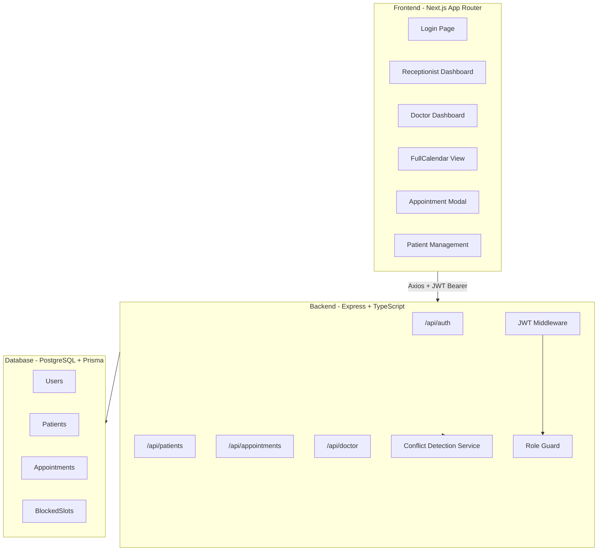

# Clinic Appointment Management System

## Architecture Overview




## Folder Structure

```
it5/
├── backend/
│   ├── prisma/
│   │   ├── schema.prisma
│   │   └── seed.ts
│   ├── src/
│   │   ├── controllers/
│   │   │   ├── auth.controller.ts
│   │   │   ├── patients.controller.ts
│   │   │   ├── appointments.controller.ts
│   │   │   └── doctor.controller.ts
│   │   ├── routes/
│   │   │   ├── auth.routes.ts
│   │   │   ├── patients.routes.ts
│   │   │   ├── appointments.routes.ts
│   │   │   └── doctor.routes.ts
│   │   ├── middleware/
│   │   │   ├── auth.ts          (JWT verify + attach req.user)
│   │   │   ├── roles.ts         (role guard factory)
│   │   │   └── errorHandler.ts
│   │   ├── services/
│   │   │   ├── auth.service.ts
│   │   │   ├── appointment.service.ts  (conflict detection lives here)
│   │   │   ├── patient.service.ts
│   │   │   └── doctor.service.ts
│   │   ├── utils/
│   │   │   ├── jwt.ts
│   │   │   └── validation.ts    (Zod schemas)
│   │   ├── app.ts
│   │   └── server.ts
│   ├── package.json
│   ├── tsconfig.json
│   └── .env.example
├── frontend/
│   ├── src/
│   │   ├── app/
│   │   │   ├── layout.tsx
│   │   │   ├── page.tsx         (root redirect)
│   │   │   ├── login/page.tsx
│   │   │   ├── dashboard/page.tsx       (receptionist)
│   │   │   ├── doctor/page.tsx
│   │   │   └── patients/
│   │   │       ├── page.tsx
│   │   │       └── [id]/page.tsx
│   │   ├── components/
│   │   │   ├── Calendar.tsx     (FullCalendar wrapper)
│   │   │   ├── AppointmentModal.tsx
│   │   │   ├── PatientSearch.tsx
│   │   │   ├── AppointmentCard.tsx
│   │   │   ├── Navbar.tsx
│   │   │   └── ProtectedRoute.tsx
│   │   ├── hooks/
│   │   │   ├── useAuth.ts
│   │   │   ├── useAppointments.ts
│   │   │   └── usePatients.ts
│   │   ├── services/
│   │   │   └── api.ts           (Axios instance + all API calls)
│   │   ├── types/
│   │   │   └── index.ts
│   │   └── context/
│   │       └── AuthContext.tsx
│   ├── package.json
│   ├── tsconfig.json
│   ├── tailwind.config.ts
│   └── .env.example
├── README.md
└── .gitignore (existing)
```

## Database Schema (Prisma)

```prisma
model User {
  id           String        @id @default(cuid())
  name         String
  email        String        @unique
  passwordHash String
  role         Role
  createdAt    DateTime      @default(now())
  appointments Appointment[]
  blockedSlots BlockedSlot[]
}

enum Role { DOCTOR RECEPTIONIST }

model Patient {
  id           String        @id @default(cuid())
  name         String
  phone        String        @unique
  email        String?
  notes        String?
  createdAt    DateTime      @default(now())
  appointments Appointment[]
}

model Appointment {
  id        String            @id @default(cuid())
  patientId String
  doctorId  String
  startTime DateTime
  endTime   DateTime
  status    AppointmentStatus @default(SCHEDULED)
  notes     String?
  createdAt DateTime          @default(now())
  patient   Patient           @relation(fields: [patientId], references: [id])
  doctor    User              @relation(fields: [doctorId], references: [id])
  @@index([doctorId, startTime, endTime])
}

enum AppointmentStatus { SCHEDULED COMPLETED CANCELLED }

model BlockedSlot {
  id        String   @id @default(cuid())
  doctorId  String
  startTime DateTime
  endTime   DateTime
  reason    String?
  createdAt DateTime @default(now())
  doctor    User     @relation(fields: [doctorId], references: [id])
}
```

## Key Architectural Decisions

**Double-booking prevention** — handled in `appointment.service.ts` using a Prisma query before any insert/update:

```typescript
const conflict = await prisma.appointment.findFirst({
  where: {
    doctorId,
    status: { not: 'CANCELLED' },
    startTime: { lt: endTime },
    endTime:   { gt: startTime },
  },
});
if (conflict) throw new ConflictError('Time slot already booked');
```

Blocked slots are checked with the same pattern against the `BlockedSlot` table.

**JWT strategy** — token stored in `localStorage`, sent as `Authorization: Bearer <token>`. The `auth.ts` middleware decodes it and attaches `req.user` (id, role).

**Role guard** — `roles.ts` is a factory: `requireRole('DOCTOR')` returns an Express middleware. Routes requiring specific roles apply both `authenticate` and `requireRole(...)`.

**Frontend auth** — `AuthContext` stores the decoded user + token, wraps the entire app, and provides `login()` / `logout()`. `ProtectedRoute` checks role before rendering a page.

**Calendar color coding** — FullCalendar events use `backgroundColor` per status:

- `SCHEDULED` → `#3B82F6` (blue)
- `COMPLETED` → `#22C55E` (green)
- `CANCELLED` → `#9CA3AF` (grey)
- Blocked slots → `#EF4444` (red)

**Validation** — Zod schemas in `utils/validation.ts` are shared by controllers. Bad input returns 400 with structured field errors.

## API Summary


| Method     | Route                     | Role         |
| ---------- | ------------------------- | ------------ |
| POST       | `/api/auth/login`         | Public       |
| POST       | `/api/auth/register`      | Public       |
| GET/POST   | `/api/patients`           | Receptionist |
| GET        | `/api/patients/search?q=` | Both         |
| GET        | `/api/patients/:id`       | Both         |
| GET/POST   | `/api/appointments`       | Both         |
| PUT/DELETE | `/api/appointments/:id`   | Both         |
| GET        | `/api/doctor/schedule`    | Doctor       |
| POST       | `/api/doctor/block-slot`  | Doctor       |


## Implementation Order

1. Backend foundation (server, Prisma, env setup)
2. Prisma schema + migrations + seed script
3. Auth (register/login, JWT, middleware)
4. Patients CRUD
5. Appointments CRUD + conflict detection
6. Doctor schedule + block-slot endpoints
7. Frontend scaffolding (Next.js, Tailwind, AuthContext)
8. Login page
9. Receptionist dashboard + calendar
10. Appointment modal (book/reschedule)
11. Doctor dashboard
12. Patient management pages
13. README with local setup + deployment instructions

## Local Setup (final README contents)

**Prerequisites:** Bun, PostgreSQL (or Neon/Supabase connection string)

```bash
# Backend
cd backend && bun install
cp .env.example .env  # fill DATABASE_URL, JWT_SECRET
bunx prisma migrate dev
bunx prisma db seed
bun dev

# Frontend
cd frontend && bun install
cp .env.example .env.local  # fill NEXT_PUBLIC_API_URL
bun dev
```

## Deployment

- **Frontend** → Vercel (set `NEXT_PUBLIC_API_URL` env var)
- **Backend** → Render/Railway (set `DATABASE_URL`, `JWT_SECRET`, `PORT`,

