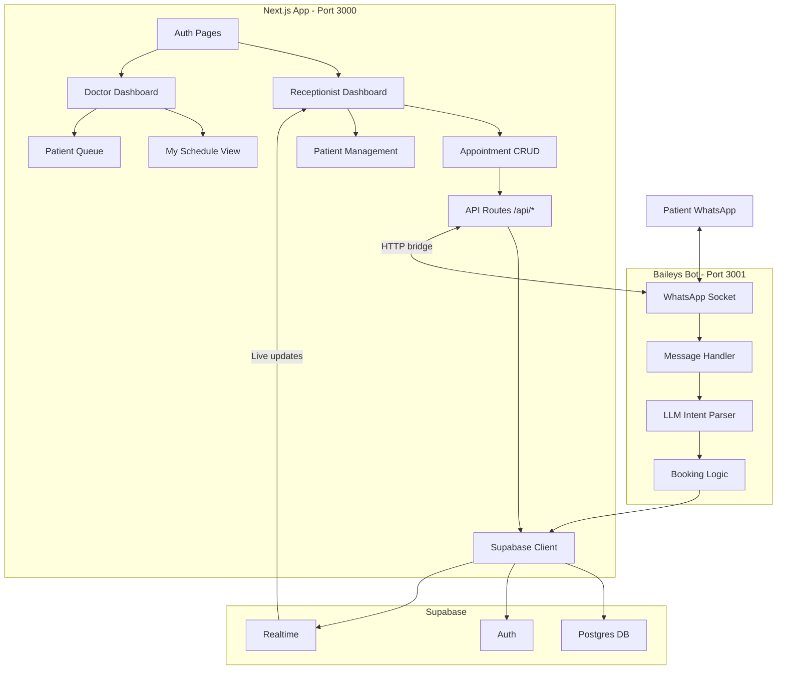
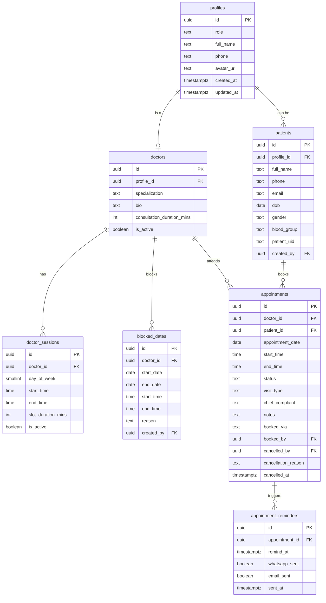

# ClinicOS — Hackathon Plan

## Tech Stack

- **Framework**: Next.js 15 (App Router) — already scaffolded
- **Database + Auth**: Supabase (Postgres + Auth + Realtime)
- **UI**: shadcn/ui + Tailwind v4 — KiviCare-inspired periwinkle-blue/coral aesthetic
- **WhatsApp Bot**: `@whiskeysockets/baileys` v6 — separate Bun process (`bot/`)
- **LLM**: Vercel AI SDK v6 (`ai@^6`, `@ai-sdk/openai-compatible@^3`) — custom OpenAI-compatible endpoint
- **Validation**: Zod v4
- **Deploy**: Vercel (Next.js) + Railway/Render (bot process)

### LLM Configuration (fully env-driven)

```
# .env.local
LLM_BASE_URL=https://your-openai-compatible-endpoint/v1
LLM_API_KEY=your-key-here
LLM_MODEL=your-model-name
```

```typescript
// lib/llm.ts — provider setup
import { createOpenAICompatible } from '@ai-sdk/openai-compatible'

const provider = createOpenAICompatible({
  name: 'clinic-llm',
  apiKey: process.env.LLM_API_KEY!,
  baseURL: process.env.LLM_BASE_URL!,
})

export const llmModel = provider(process.env.LLM_MODEL!)
```

AI SDK v6 note: `generateObject` is **deprecated** in v6. Use `generateText` + `Output.object()`:

```typescript
import { generateText, Output } from 'ai'
import { z } from 'zod'

const { output } = await generateText({
  model: llmModel,
  output: Output.object({ schema: BookingIntentSchema }),
  messages: [...conversationHistory],
})
```

---

## Architecture




---

## Phase 0 — Database Schema (Run Before Everything Else)

The full schema is written once, covers all 3 phases, and deployed to Supabase before a single line of UI is written. This prevents painful migrations mid-build.

**Migration file**: `supabase/migrations/001_initial_schema.sql`

### Entity Relationship




### Postgres Enums

```sql
CREATE TYPE user_role AS ENUM ('receptionist', 'doctor', 'patient');
CREATE TYPE appointment_status AS ENUM ('pending', 'booked', 'checked_in', 'checked_out', 'cancelled', 'no_show');
CREATE TYPE visit_type AS ENUM ('in_person', 'virtual');
CREATE TYPE booking_channel AS ENUM ('web', 'whatsapp', 'walk_in');
```

### Tables

`**profiles**` — mirrors `auth.users`, created by trigger on signup:

- `id UUID PRIMARY KEY REFERENCES auth.users(id) ON DELETE CASCADE`
- `role user_role NOT NULL DEFAULT 'patient'`
- `full_name TEXT NOT NULL DEFAULT ''`
- `phone TEXT`, `avatar_url TEXT`
- `created_at`, `updated_at TIMESTAMPTZ`

`**doctors**` — doctor-specific metadata:

- `id UUID PRIMARY KEY DEFAULT gen_random_uuid()`
- `profile_id UUID NOT NULL REFERENCES profiles(id) ON DELETE CASCADE`
- `specialization TEXT NOT NULL`
- `bio TEXT`, `is_active BOOLEAN DEFAULT true`
- `consultation_duration_mins INT NOT NULL DEFAULT 30`

`**doctor_sessions**` — recurring weekly availability (KiviCare's `kc_clinic_sessions`):

- `id UUID PK`, `doctor_id UUID FK → doctors.id ON DELETE CASCADE`
- `day_of_week SMALLINT NOT NULL` (0=Sun … 6=Sat)
- `start_time TIME NOT NULL`, `end_time TIME NOT NULL`
- `slot_duration_mins INT NOT NULL DEFAULT 30`
- `is_active BOOLEAN DEFAULT true`
- `UNIQUE(doctor_id, day_of_week, start_time)`

`**blocked_dates**` — holidays and OOO (KiviCare's `kc_clinic_schedule`):

- `id UUID PK`, `doctor_id UUID FK → doctors.id ON DELETE CASCADE`
- `start_date DATE NOT NULL`, `end_date DATE NOT NULL`
- `start_time TIME`, `end_time TIME` (NULL = full-day block)
- `reason TEXT`, `created_by UUID FK → profiles.id`

`**patients**` — patient records, supports walk-ins without auth account:

- `id UUID PK DEFAULT gen_random_uuid()`
- `profile_id UUID FK → profiles(id)` — **NULLABLE** (walk-ins have no auth account)
- `full_name TEXT NOT NULL`, `phone TEXT`, `email TEXT`, `dob DATE`
- `gender TEXT`, `blood_group TEXT`, `address TEXT`
- `patient_uid TEXT NOT NULL UNIQUE DEFAULT ('PT-' || LPAD(nextval('patient_uid_seq')::text, 4, '0'))`
- `created_by UUID FK → profiles.id`
- `created_at`, `updated_at`

`**appointments`** — core booking table (KiviCare's `kc_appointments`):

- `id UUID PK DEFAULT gen_random_uuid()`
- `doctor_id UUID NOT NULL FK → doctors.id`
- `patient_id UUID NOT NULL FK → patients.id`
- `appointment_date DATE NOT NULL`
- `start_time TIME NOT NULL`, `end_time TIME NOT NULL`
- `status appointment_status NOT NULL DEFAULT 'pending'`
- `visit_type visit_type NOT NULL DEFAULT 'in_person'`
- `chief_complaint TEXT`, `notes TEXT`
- `booked_via booking_channel NOT NULL DEFAULT 'web'`
- `booked_by UUID FK → profiles.id`
- `cancelled_at TIMESTAMPTZ`, `cancelled_by UUID FK → profiles.id`, `cancellation_reason TEXT`
- `created_at`, `updated_at`
- `UNIQUE(doctor_id, appointment_date, start_time)` — **DB-level clash prevention**

`**appointment_reminders`** — tracks what reminders have been sent:

- `id UUID PK`, `appointment_id UUID NOT NULL FK → appointments.id ON DELETE CASCADE`
- `remind_at TIMESTAMPTZ NOT NULL`
- `whatsapp_sent BOOLEAN DEFAULT false`, `email_sent BOOLEAN DEFAULT false`
- `sent_at TIMESTAMPTZ`

### Indexes (query performance)

```sql
-- Most common dashboard query
CREATE INDEX idx_appointments_doctor_date ON appointments(doctor_id, appointment_date);
-- Patient history
CREATE INDEX idx_appointments_patient ON appointments(patient_id);
-- Date-range queries for schedule
CREATE INDEX idx_appointments_date_status ON appointments(appointment_date, status);
-- Slot generation
CREATE INDEX idx_doctor_sessions_doctor_day ON doctor_sessions(doctor_id, day_of_week);
-- Blocked date overlap check
CREATE INDEX idx_blocked_dates_doctor ON blocked_dates(doctor_id, start_date, end_date);
-- Reminder cron job
CREATE INDEX idx_reminders_pending ON appointment_reminders(remind_at) WHERE whatsapp_sent = false;
```

### Triggers & Functions

**Auto-create profile on signup** (fires on `auth.users` INSERT):

```sql
CREATE OR REPLACE FUNCTION handle_new_user() RETURNS TRIGGER AS $$
BEGIN
  INSERT INTO public.profiles (id, full_name, phone, role)
  VALUES (
    NEW.id,
    COALESCE(NEW.raw_user_meta_data->>'full_name', ''),
    COALESCE(NEW.raw_user_meta_data->>'phone', ''),
    COALESCE((NEW.raw_user_meta_data->>'role')::user_role, 'patient')
  );
  RETURN NEW;
END;
$$ LANGUAGE plpgsql SECURITY DEFINER;
CREATE TRIGGER on_auth_user_created AFTER INSERT ON auth.users
  FOR EACH ROW EXECUTE FUNCTION handle_new_user();
```

**Auto-update `updated_at`** (applied to `profiles`, `patients`, `appointments`):

```sql
CREATE OR REPLACE FUNCTION update_updated_at() RETURNS TRIGGER AS $$
BEGIN NEW.updated_at = NOW(); RETURN NEW; END;
$$ LANGUAGE plpgsql;
```

**Patient UID sequence**:

```sql
CREATE SEQUENCE IF NOT EXISTS patient_uid_seq START 1;
-- Used as column default on patients.patient_uid (see above)
```

### RLS Policies Summary


| Table                   | Receptionist        | Doctor                   | Patient (authed)  |
| ----------------------- | ------------------- | ------------------------ | ----------------- |
| `profiles`              | read all, write own | read all, write own      | read/write own    |
| `doctors`               | full CRUD           | read all, update own     | read only         |
| `doctor_sessions`       | full CRUD           | read + manage own        | read only         |
| `blocked_dates`         | full CRUD           | read + manage own        | —                 |
| `patients`              | full CRUD           | read own patients        | read/write own    |
| `appointments`          | full CRUD           | read + update status own | read + cancel own |
| `appointment_reminders` | read all            | read own                 | —                 |


All policies use `auth.uid()` and join to `profiles` to check role. Service role key (used in API routes and bot) bypasses RLS entirely.

---

## Phase 0 — Setup & Database (~30 min, before the clock starts)

**Goal: Environment ready, all dependencies installed, full schema live in Supabase.**

- Install all deps at once (do not install incrementally — wastes time mid-build):

```
  bun add @supabase/supabase-js @supabase/ssr zod
  bun add ai @ai-sdk/openai-compatible
  bun add @phosphor-icons/react
  bun add resend
  bun add @whiskeysockets/baileys @hapi/boom (inside bot/)
  bunx shadcn@latest init
  

```

- Set up Supabase project, copy keys into `.env.local`
- Run `001_initial_schema.sql` in Supabase SQL editor — this creates all tables, enums, indexes, triggers, RLS, and the `patient_uid_seq` sequence in one shot
- Manually create 2 seed users via Supabase Dashboard: one receptionist, one doctor (to test with immediately)
- Verify: open Supabase Table Editor, confirm all 7 tables exist with correct columns

---

## Phase 1 — Core Clinic OS (Hours 1–5)

**Goal: A fully working appointment management system with auth and role flows.**

### Setup

- Configure env vars: `NEXT_PUBLIC_SUPABASE_URL`, `NEXT_PUBLIC_SUPABASE_ANON_KEY`, `SUPABASE_SERVICE_ROLE_KEY`, `LLM_BASE_URL`, `LLM_API_KEY`, `LLM_MODEL`
- Set up Tailwind v4 CSS variables in `globals.css` with KiviCare color tokens
- Load Heebo + Poppins fonts in `app/layout.tsx`

### Auth (`app/(auth)/`)

- `/login` — email+password, role detected from `profiles` table post-login
- Middleware at `middleware.ts` — redirects `/` → `/receptionist` or `/doctor` based on role
- Supabase SSR auth helpers (`@supabase/ssr`) for cookie-based sessions

### Receptionist Dashboard (`app/receptionist/`)

- **Today's Schedule** — timeline view of all appointments for today, grouped by doctor
- **Quick Book** — slide-in drawer: select doctor → pick available slot (clash-safe) → enter/search patient → confirm
- **Appointment list** — filterable table (date, doctor, status) with inline status update, cancel, reschedule
- **Patient management** — search/create patients, auto-generate `patient_uid`

### Doctor Dashboard (`app/doctor/`)

- **My Queue** — today's appointments in chronological order, with status progression (Check-in → Check-out)
- **My Availability** — weekly schedule editor (set recurring time blocks per day)
- **Blocked Dates** — mark holidays or OOO ranges

### Scheduling Logic (`lib/scheduling.ts`)

- `getAvailableSlots(doctorId, date)` — generates slots from `doctor_sessions`, subtracts booked appointments and blocked dates
- `bookAppointment(...)` — server action with optimistic lock via Supabase transaction to prevent race conditions

---

## Phase 2 — Polish & Completeness (Hours 5–8)

**Goal: Make it demo-worthy and feature-complete enough to win on depth.**

### Calendar View

- shadcn-compatible week/day calendar (`react-big-calendar` or custom grid)
- Color-coded by status: pending=yellow, booked=blue, checked-in=green, cancelled=red
- Drag-to-reschedule (stretch goal)

### Real-time Updates (Supabase Realtime)

- Receptionist dashboard auto-refreshes when any appointment changes
- Doctor queue updates live when receptionist checks a patient in
- "New appointment" toast notification on both dashboards

### Analytics / Dashboard Stats

- Cards: Total appointments today, completion rate, cancellation rate, upcoming
- Top doctors by appointment count this week
- Inspired by KiviCare's `GET /dashboard/statistics/{component}` pattern

### Encounter Notes (Lite)

- Doctor can add a quick clinical note / chief complaint summary post check-in
- Free-text for hackathon; structured SOAP note as stretch

### Email Notifications

- Use Supabase Edge Functions or Next.js API route + Resend SDK
- Templates: booking confirmation, cancellation, reminder (24h before)

---

## Phase 3 — Killer Features (Hours 8–12)

**Goal: The wow factor that wins the hackathon.**

### WhatsApp Bot (`bot/`)

Separate Bun process bridged to Next.js via HTTP:

```
bot/
  index.ts          # Entry: connect Baileys, start HTTP server
  whatsapp.ts       # Socket setup, QR, reconnect logic
  message-handler.ts # Routes messages to LLM
  conversation-store.ts # In-memory Map for session state
  http-server.ts    # Express/Hono server on :3001 for /send endpoint
```

**Flows supported:**

- Patient texts "Book appointment with Dr. Ahmed tomorrow at 3pm"
- Bot (via LLM) asks for missing info conversationally
- Bot confirms booking and saves to Supabase
- Automated reminders sent 1 hour before appointment
- Patient can reply CONFIRM or CANCEL

### LLM-Powered Booking (`lib/llm.ts`)

Using AI SDK v6's non-deprecated API with a custom OpenAI-compatible provider:

```typescript
import { generateText, Output } from 'ai'
import { z } from 'zod'
import { llmModel } from './llm'    // createOpenAICompatible-backed model

const BookingIntentSchema = z.object({
  intent: z.enum(['book', 'cancel', 'reschedule', 'confirm', 'query', 'unknown']),
  doctorName: z.string().optional(),
  preferredDate: z.string().optional(),
  preferredTime: z.string().optional(),
  symptoms: z.string().optional(),
  missingInfo: z.array(z.string()),
})

export async function parseBookingIntent(history: ModelMessage[]) {
  const { output } = await generateText({
    model: llmModel,
    output: Output.object({ schema: BookingIntentSchema }),
    messages: history,
  })
  return output   // fully typed, no JSON.parse() needed
}
```

Multi-turn conversation: bot holds context per WhatsApp JID, asks for only missing fields, then calls the same booking API as the web UI.

### WhatsApp QR in UI

- `/admin/whatsapp` page streams QR code from bot server via SSE
- Shows connection status (Disconnected / Scanning / Connected)
- Message log view for transparency during demo

---

## Folder Structure

```
it3/
├── app/
│   ├── (auth)/login/page.tsx
│   ├── receptionist/
│   │   ├── page.tsx              # Dashboard
│   │   ├── appointments/page.tsx
│   │   └── patients/page.tsx
│   ├── doctor/
│   │   ├── page.tsx              # My queue
│   │   └── availability/page.tsx
│   ├── api/
│   │   ├── appointments/route.ts
│   │   ├── slots/route.ts
│   │   └── whatsapp/send/route.ts
│   └── layout.tsx
├── components/
│   ├── appointments/             # BookingDrawer, AppointmentCard, StatusBadge
│   ├── schedule/                 # SlotPicker, WeeklyGrid, CalendarView
│   ├── patients/                 # PatientSearch, PatientForm
│   └── ui/                       # shadcn generated components
├── lib/
│   ├── supabase/                 # client.ts, server.ts, middleware.ts
│   ├── scheduling.ts             # Slot generation + clash prevention
│   └── llm.ts                    # generateObject booking parser
├── bot/
│   ├── index.ts
│   ├── whatsapp.ts
│   ├── message-handler.ts
│   └── conversation-store.ts
├── supabase/
│   └── migrations/               # SQL schema files
└── middleware.ts
```

---

## Design Direction — KiviCare-Inspired

We take **heavy visual inspiration** from KiviCare's proven design system, modernized for shadcn/ui + Tailwind v4:

### Color Palette (from KiviCare source)


| Role             | KiviCare Token       | Hex       | Our Usage                                    |
| ---------------- | -------------------- | --------- | -------------------------------------------- |
| Primary          | `--iq-primary`       | `#7093E5` | Buttons, active nav, slot selection, links   |
| Primary hover    | `--iq-primary-dark`  | `#5f84d9` | Hover states                                 |
| Primary tint     | `--iq-primary-light` | `#F0F4FD` | Input backgrounds, selected card bg          |
| Secondary/Accent | `--iq-secondary`     | `#F68685` | Specialty labels, cancel badges, accents     |
| Success          | `--iq-success`       | `#13C39C` | Checked-in/completed status, step completion |
| Page background  | `--iq-body-bg`       | `#f5f6fa` | App shell background                         |
| Card background  | `--iq-white`         | `#ffffff` | Cards, modals, sidebar                       |
| Card border      | `--iq-border-color`  | `#e0e0e0` | All card/input borders                       |
| Heading text     | `--iq-heading-color` | `#3F414D` | Section titles, card headers                 |
| Body text        | `--iq-body-color`    | `#6E7990` | Labels, secondary text                       |
| Warning          | `--iq-warning`       | `#FFC107` | Pending/upcoming appointments                |


These map directly to Tailwind v4 CSS variables in `globals.css`.

### Typography (from KiviCare source)

- **Headings**: `Heebo` (Google Fonts, weight 500/600) — same as KiviCare's dashboard
- **Body**: `Poppins` (Google Fonts, weight 400/500) — same as KiviCare's booking forms
- Both replace Geist in `app/layout.tsx`

### Icons

- **Phosphor Icons** (`phosphor-react`) — exact same icon library KiviCare uses (outline + filled variants)

### Key UI Patterns to Replicate

1. **Multi-step booking wizard** — blue left sidebar (`#7093E5` bg) with white vertical step list + circular bullets, right white panel slides between steps. This is KiviCare's most distinctive UI element.
2. **Slot picker grid** — `grid-template-columns: repeat(auto-fill, minmax(90px, 1fr))`, each slot a pill button with primary-blue selected state
3. **Cards** — `bg-white border border-[#e0e0e0] rounded-lg shadow-[0_1px_30px_rgba(0,0,0,0.08)]`
4. **Form inputs** — `bg-[#F0F4FD]` background (primary-tinted, not plain white), matching KiviCare's visual language
5. **Status badges** — color-coded: pending=`#FFC107`, booked=`#7093E5`, checked-in=`#13C39C`, cancelled=`#F54438`
6. **Admin layout** — left sidebar (white, 260px) + top header bar + `#f5f6fa` content area — matching KiviCare's dashboard layout
7. **Doctor cards** — circular avatar, name in `#3F414D`, specialization in coral `#F68685`, session time pills in 3-column grid
8. **Buttons** — `padding: 8px 32px`, `border-radius: 4px`, `font-weight: 600`, uppercase — with hover slide-effect

### Differentiator vs KiviCare

Same great visual language + Real-time updates + WhatsApp-native booking + Conversational AI — all in a modern Next.js SPA vs a slow WordPress plugin.

---

## Phase Summary


| Phase          | Time                     | Deliverable                                                                            |
| -------------- | ------------------------ | -------------------------------------------------------------------------------------- |
| 0 — Foundation | pre-clock / first 30 min | Full DB schema live, all deps installed, seed users created                            |
| 1 — Core       | Hours 1–5                | Auth, role dashboards, appointment CRUD, clash-safe slot booking, patient management   |
| 2 — Polish     | Hours 5–8                | Calendar view, realtime updates, analytics cards, email notifications, encounter notes |
| 3 — Killer     | Hours 8–12               | WhatsApp bot + LLM conversational booking, reminder cron, QR admin page                |


